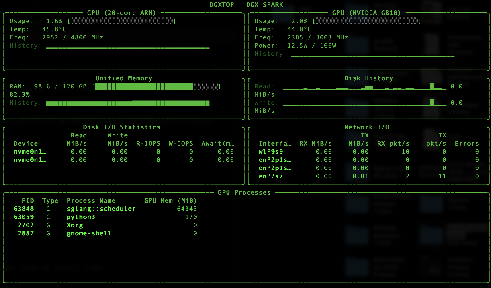
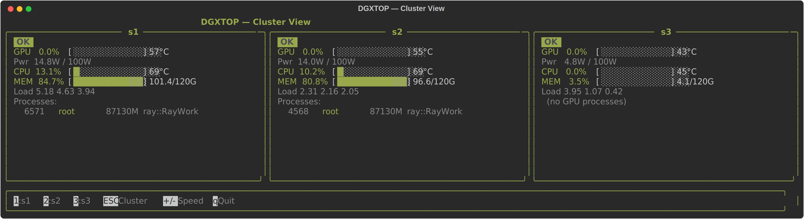

# DGXTOP for The DGX SPARK

> **Fork Notice**: This is a fork of [GigCoder-ai/dgxtop](https://github.com/GigCoder-ai/dgxtop) with enhanced GPU process monitoring features. Maintained by [SonusFlow AI](https://github.com/sonusflow).

A performance monitoring CLI tool for Ubuntu inspired by asitop for Mac, with added volume transfer speed monitoring and multi-node cluster monitoring capabilities.



## Features

- **GPU Process Monitoring**: View running GPU processes with PID, user, GPU/CPU usage, memory (nvtop-style)
- **Interactive Process Management**: Navigate, sort, and kill GPU processes
- **Volume Transfer Speed Monitoring**: Real-time read/write speed tracking per drive
- **System Monitoring**: GB10 GPU, CPU, memory, and network statistics
- **Real-time Display**: Interactive terminal interface with customizable update intervals
- **Lightweight**: Minimal dependencies, uses native Linux `/proc` filesystem
- **Per-Drive Performance**: Detailed breakdown of I/O performance for each storage device
- **Cluster Monitoring**: Monitor multiple DGX Spark nodes side-by-side in a single terminal

## Installation on DGX Spark

### Prerequisites

- NVIDIA DGX Spark with Ubuntu
- Python 3.8+
- `nvidia-smi` (included with NVIDIA drivers)

### Quick Install (Build from Source)

SSH into your DGX Spark and run:

```bash
# 1. Install build dependencies
sudo apt update
sudo apt install -y git debhelper dh-python python3-all python3-setuptools dpkg-dev

# 2. Clone the repository
git clone https://github.com/sonusflow/dgxtop.git
cd dgxtop

# 3. Build the .deb package
dpkg-buildpackage -us -uc -b

# 4. Install
sudo apt install ../dgxtop_1.0.0-1_all.deb
```

### Verify Installation

```bash
dgxtop --version
dgxtop
```

### Uninstall

```bash
sudo apt remove dgxtop
```

### Upgrade

```bash
cd dgxtop
git pull
dpkg-buildpackage -us -uc -b
sudo apt install --reinstall ../dgxtop_1.0.0-1_all.deb
```

### Original Repository

For the original version without fork enhancements, see [GigCoder-ai/dgxtop](https://github.com/GigCoder-ai/dgxtop)

## Usage

### Basic Usage

```bash
dgxtop
```

### Options

```bash
dgxtop --interval 0.5        # Update every 0.5 seconds
dgxtop -i 2.0                # Update every 2 seconds
dgxtop --version             # Show version information
```

### Interactive Controls

| Key | Action |
|-----|--------|
| `j` / `k` | Navigate up/down in process list |
| `s` | Enter sort mode (cycle sort columns) |
| `K` (Shift+k) | Enter kill mode for selected process |
| `Enter` | Confirm action |
| `Esc` | Cancel mode |
| `+` / `-` | Speed up / slow down refresh |
| `q` | Quit |

---

## Cluster Monitoring

Monitor multiple DGX Spark nodes side-by-side in a single terminal view. Each node shows GPU, CPU, memory, load average, and top GPU processes at a glance.



### Quick Start (Ad-hoc)

Pass hostnames directly — the first host is assumed to be the local node:

```bash
dgxtop --cluster s1 s2 s3
```

### Cluster Config File

For a persistent setup, create a config at `~/.config/dgxtop/cluster.toml`:

```bash
# Generate an example config file
dgxtop --cluster-init
```

This writes `~/.config/dgxtop/cluster.toml`. Edit it to match your nodes:

```toml
[cluster]
update_interval = 1.0

[[cluster.nodes]]
name = "s1"
host = "s1"
user = "dgx"
local = true          # marks this as the local node

[[cluster.nodes]]
name = "s2"
host = "s2"
user = "dgx"

[[cluster.nodes]]
name = "s3"
host = "s3"
user = "dgx"
```

Once `~/.config/dgxtop/cluster.toml` exists, running `dgxtop` with no arguments automatically enters cluster mode.

### Cluster Options

| Option | Description |
|--------|-------------|
| `--cluster HOST [HOST ...]` | Ad-hoc cluster: space-separated list of hostnames |
| `--cluster-config PATH` | Load a specific cluster config TOML file |
| `--cluster-init` | Write an example `cluster.toml` to the default location and exit |

### Cluster Interactive Controls

| Key | Action |
|-----|--------|
| `1` / `2` / `3` ... | Drill into node N (full view for local node, detail panel for remote) |
| `Esc` | Return to cluster summary |
| `+` / `-` | Speed up / slow down refresh for all nodes |
| `q` | Quit |

### SSH Setup for Remote Nodes

Cluster mode connects to remote nodes over SSH using `ssh-agent` or key-based auth. Make sure your SSH key is trusted on each node:

```bash
ssh-copy-id dgx@s2
ssh-copy-id dgx@s3
```

Custom ports and usernames are supported in `cluster.toml` via `port` and `user` fields.

## Architecture

```
dgxtop/
├── __init__.py              # Package initialization
├── main.py                  # Main application entry point (single-node & cluster)
├── gpu_monitor.py           # GPU monitoring (nvidia-smi)
├── gpu_processes_monitor.py # GPU process monitoring (nvtop-style)
├── disk_monitor.py          # Disk I/O monitoring (/proc/diskstats)
├── system_monitor.py        # CPU, memory, network monitoring
├── network_monitor.py       # Network interface monitoring
├── rich_ui.py               # Single-node terminal UI (Rich library)
├── cluster_config.py        # Cluster TOML config loader and dataclasses
├── cluster_monitor.py       # Background SSH data collection for remote nodes
├── cluster_ui.py            # Cluster summary and drill-down UI panels
├── config.py                # Application configuration
└── logger.py                # Logging system
```

## Fork Enhancements

This fork adds the following features not in the original:

- **GPU Process Panel**: Displays running GPU processes with:
  - PID, User, Device, Type (Compute/Graphic)
  - GPU utilization %, GPU memory usage
  - CPU %, Host memory usage
  - Full command line
- **Interactive Controls**: vim-style navigation (j/k), sort mode, kill mode
- **Visual Selection**: Highlighted process selection with reverse video

## Technical Details

### Volume Transfer Speed Calculation

The tool calculates transfer speeds by reading `/proc/diskstats` at regular intervals:

```
Read/Write Bytes per Second = (Δsectors) × 512 bytes / Δtime
```

### Data Sources

- **Disk Statistics**: `/proc/diskstats`
- **CPU Statistics**: `/proc/stat`
- **Memory Statistics**: `/proc/meminfo`
- **Network Statistics**: `/proc/net/dev`
- **GPU Statistics**: `nvidia-smi`
- **GPU Processes**: `nvidia-smi --query-compute-apps` and `nvidia-smi pmon`

## Requirements

- Python 3.8+
- DGX Spark with NVIDIA Ubuntu
- Rich library (installed automatically)

## License

Apache 2.0 License - see [LICENSE](LICENSE) file for details.

## Credits

- **Original Author**: [GigCoder-ai](https://github.com/GigCoder-ai)
- **Fork Maintainer**: [SonusFlow AI](https://github.com/sonusflow)
- Inspired by [asitop](https://github.com/tlkh/asitop) for Mac

## Roadmap

- [x] Add GPU process monitoring
- [x] Add interactive process navigation
- [x] Add sort and kill functionality
- [x] Add multi-node cluster monitoring
- [x] Add cluster TOML configuration support
- [ ] Implement alerting thresholds
- [ ] Create systemd service option
